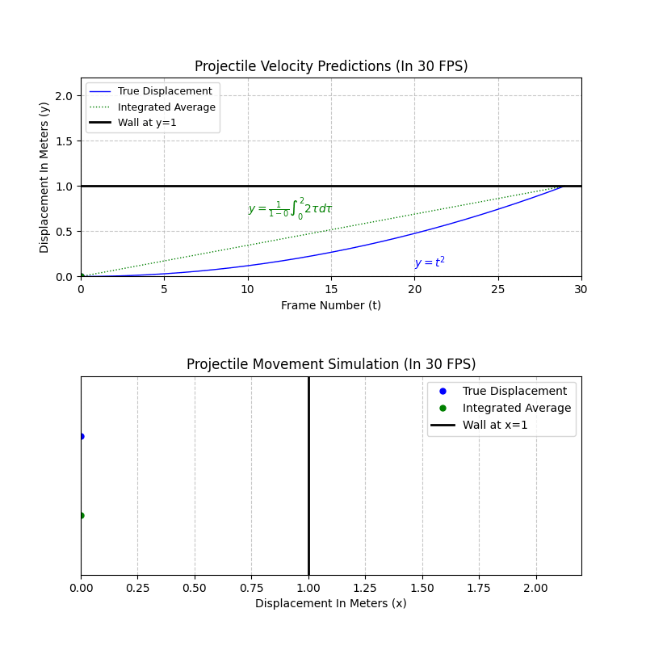

# integral-calculus

## Visualization



## Pre-requisites

- pip (version 24.0 or higher)
- python (version 3.11.9 or higher)

## Setup

1. Create an empty folder and open CMD

2. Execute this command to clone the GitHub project

``` cmd

git clone https://github.com/CedricDeVon/integral-calculus.git

```

3. Double-check if you are connected to the internet. Next, execute the following commands one-by-one

``` cmd

python -m venv .

Scripts/activate

pip install numpy matplotlib

```

4. Run the python script

``` cmd

python main.py

```

## References

- Reducible. (2021, January 19). Building Collision Simulations: An Introduction to Computer graphics [Video]. YouTube. https://www.youtube.com/watch?v=eED4bSkYCB8
- Havok Enthusiast. (2012, February 16). 11 - Collision Basics III - Continuous Physics [Video]. YouTube. https://www.youtube.com/watch?v=aE7GA1stIUk
- Technologies, U. (n.d.-a). Unity - Manual: Choose a collision detection mode. https://docs.unity3d.com/6000.1/Documentation/Manual/choose-collision-detection-mode.html
- Technologies, U. (n.d.). Unity - Manual: Speculative CCD. https://docs.unity3d.com/Manual/speculative-ccd.html
